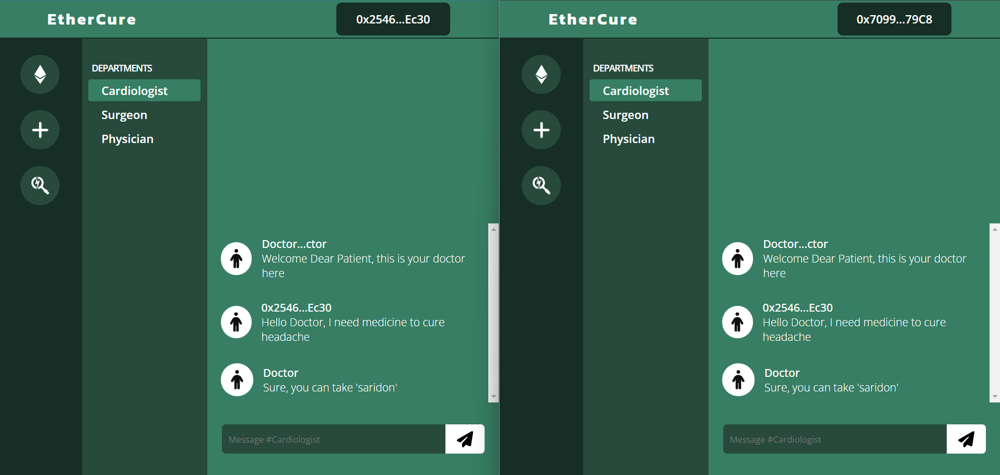
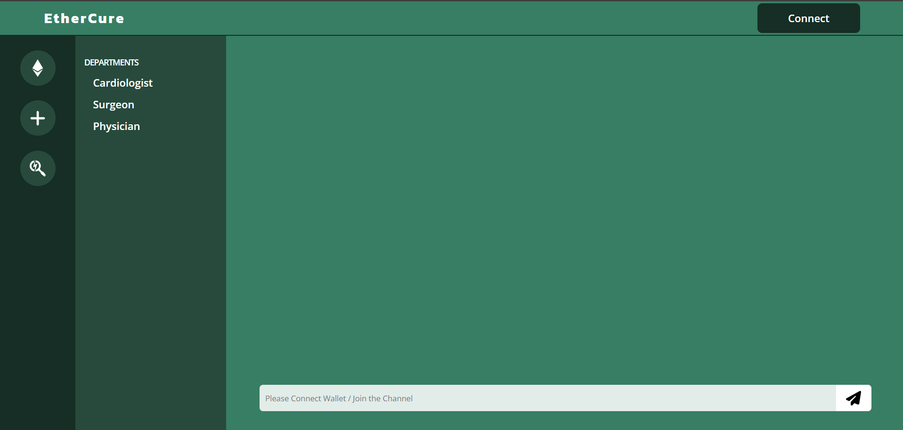
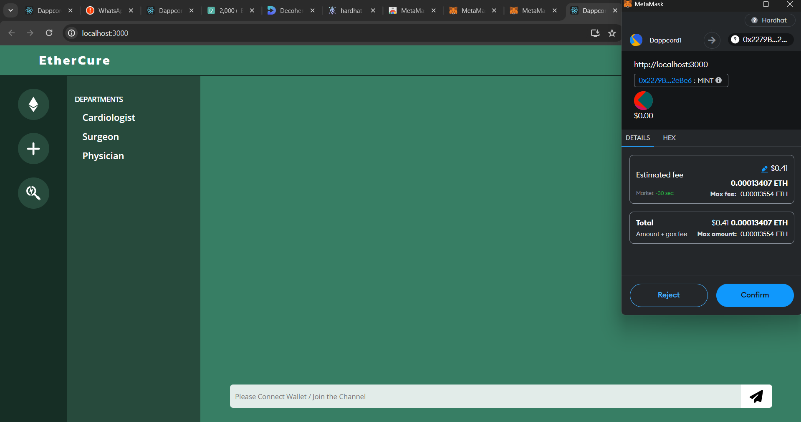

## Requirements For Initial Setup
- Install [NodeJS](https://nodejs.org/en/)

## Setting Up
### 1. Clone/Download the Repository

### 2. Install Dependencies:
`$ npm install`

### 3. Run tests
`$ npx hardhat test`

### 4. Start Hardhat node
`$ npx hardhat node`

### 5. Run deployment script
In a separate terminal execute:
`$ npx hardhat run ./scripts/deploy.js --network localhost`

### 6. Start Socket.io server
`$ node server.js`

### 7. Start frontend
In a separate terminal execute:
`$ npm run start`

